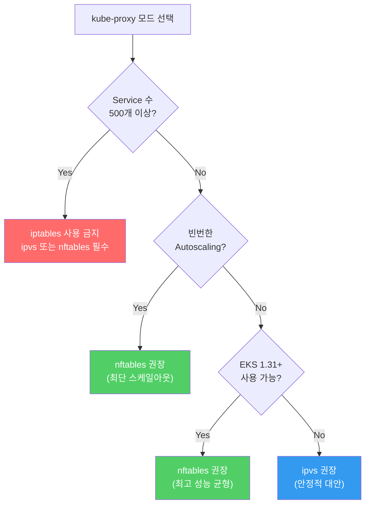

# 결론 및 권장사항

## 종합 비교표

| 평가 항목 | iptables | ipvs | nftables |
|-----------|:--------:|:----:|:--------:|
| Full Sync 속도 | 29.55s | ~1-2s | **1.56s** |
| Regular Sync 속도 | 0.737s | **0.232s** | 0.260s |
| QPS (1K conn) | **39,036** | 31,702 | 37,558 |
| P99 (5K conn) | 491ms | 400ms | **391ms** |
| 스케일아웃 총 시간 | 73.5s | ~78s | **45.6s** |
| O(1) 패킷 룩업 | X | O | O |
| 대규모 Service 확장성 | X | **O** | **O** |
| 프로덕션 성숙도 | **O** | O | △ |

:::tip 범례
- **O** : 우수 / 지원
- **△** : 보통 / 제한적
- **X** : 미흡 / 미지원
- **볼드체** : 해당 항목 최고 성능
:::

## 핵심 결론



:::danger iptables 선형 Sync의 근본 문제
iptables 모드의 **initial sync 시간은 Service 수에 비례하여 선형 증가**합니다. 이것이 프로덕션 환경에서 **50-100초 지연**의 근본 원인입니다.

| Service 수 | iptables Full Sync | nftables Full Sync |
|-----------|-------------------|-------------------|
| 101 | 29.5s | 1.6s |
| 500 | ~150s | ~8s |
| 1,000 | ~300s | ~16s |

Service 500개 이상의 클러스터에서 iptables 모드는 **더 이상 적합하지 않습니다**.
:::

## 환경별 권장사항

### 빈번한 오토스케일링 환경

| 권장 | 모드 | 이유 |
|:----:|------|------|
| **1순위** | **nftables** | 45.6s 최단 스케일아웃, 빠른 Full Sync(1.56s) |
| 2순위 | ipvs | 빠른 개별 Sync(0.232s), Full Sync 없음 |
| 비권장 | iptables | 29.5s Full Sync → 신규 노드 서비스 지연 |

### 대규모 Service (500+) 환경

| 권장 | 모드 | 이유 |
|:----:|------|------|
| **1순위** | **ipvs** | O(1) hash lookup, 검증된 대규모 운영 실적 |
| **1순위** | **nftables** | O(1) set lookup, 빠른 Sync |
| **금지** | iptables | O(n) 룰 탐색 → 패킷 처리 성능 저하, ~150s+ Sync |

### 안정성 최우선 환경

| 권장 | 모드 | 이유 |
|:----:|------|------|
| **1순위** | **ipvs** | 오랜 대규모 운영 검증, 안정적 P99(400ms) |
| 2순위 | iptables | 가장 오래된 기본 모드 (소규모 한정) |
| 3순위 | nftables | 아직 프로덕션 트랙 레코드 부족 |

### 최신 성능 추구 환경

| 권장 | 모드 | 이유 |
|:----:|------|------|
| **1순위** | **nftables** | 최고 P99 안정성, 최단 스케일아웃, EKS 1.31+ |
| 2순위 | ipvs | 안정적 대안 |
| 비권장 | iptables | 성능 확장성 한계 |

## 마이그레이션 가이드

kube-proxy 모드는 EKS addon `configurationValues` 업데이트로 변경할 수 있습니다:

```bash
# 현재 모드 확인
aws eks describe-addon --cluster-name my-cluster \
  --addon-name kube-proxy \
  --query 'addon.configurationValues'

# ipvs로 변경
aws eks update-addon --cluster-name my-cluster \
  --addon-name kube-proxy \
  --configuration-values '{"mode": "ipvs", "ipvs": {"scheduler": "rr"}}'

# nftables로 변경 (EKS 1.31+)
aws eks update-addon --cluster-name my-cluster \
  --addon-name kube-proxy \
  --configuration-values '{"mode": "nftables"}'
```

:::warning 모드 변경 시 주의사항
- kube-proxy 모드 변경 후 **모든 노드의 kube-proxy Pod가 재시작**됩니다
- 재시작 중 일시적으로 Service 라우팅이 중단될 수 있습니다
- **롤링 업데이트**로 진행되므로 전체 중단은 아니지만, 테스트 환경에서 먼저 검증하세요
- 변경 전 기존 iptables/ipvs 룰은 자동으로 정리됩니다
:::

## 최종 요약

> **Service 수가 적은(100개 미만) 소규모 클러스터에서는 iptables가 여전히 좋은 선택입니다.
> 하지만 Service 수가 증가하고 오토스케일링이 빈번한 프로덕션 환경에서는,
> nftables(EKS 1.31+) 또는 ipvs로의 전환을 적극 검토해야 합니다.**
