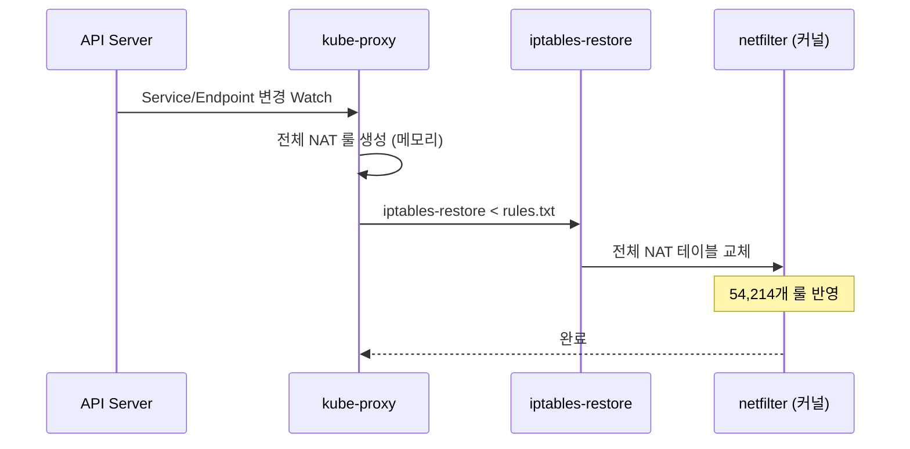

# iptables 모드 심층 분석

## 동작 원리

kube-proxy iptables 모드는 Linux 커널의 `netfilter` 프레임워크를 활용합니다. Service와 Endpoint 변경이 감지되면, 전체 NAT 룰셋을 `iptables-restore` 명령으로 **원자적(atomic)으로 교체**합니다.



### iptables-restore의 동작

```bash
# kube-proxy가 내부적으로 수행하는 작업
iptables-save -t nat > /tmp/current-rules.txt
# 전체 룰 재생성 후
iptables-restore -t nat < /tmp/new-rules.txt
```

매 sync마다 전체 NAT 테이블을 교체하므로, Service 수에 비례하여 sync 시간이 증가합니다.

## 룰 구조 및 통계

### NAT 룰 수

| 항목 | 값 |
|------|------|
| 총 NAT 룰 수 (IPv4) | **54,214** |
| Service 수 | 101 |
| Service당 평균 룰 수 | **~537개** |
| EndpointSlice 수 | 201 |

### 체인 구조

```
KUBE-SERVICES (진입점)
├── KUBE-SVC-xxx (Service별 체인) × 101개
│   ├── KUBE-SEP-xxx (Endpoint별 체인) × ~180개
│   │   ├── -A KUBE-SEP-xxx -p tcp -j DNAT --to-destination 10.0.x.x:80
│   │   └── -A KUBE-SEP-xxx -j MARK --set-xmark 0x4000/0x4000
│   └── probability-based load balancing rules
├── KUBE-NODEPORTS
└── KUBE-MARK-MASQ
```

### O(n) 순차 탐색

패킷이 도착하면 `KUBE-SERVICES` 체인에서 **순차적으로** 매칭되는 Service를 찾습니다:

```
패킷 도착
  → KUBE-SERVICES 체인 진입
  → Rule 1: svc-001 매칭? → No
  → Rule 2: svc-002 매칭? → No
  → ...
  → Rule 100: svc-100 매칭? → Yes → KUBE-SVC-xxx로 분기
```

이 O(n) 탐색은 Service 수가 증가할수록 **패킷당 처리 시간**이 선형적으로 증가합니다.

## Sync Duration 메트릭

### Full Sync

```promql
kubeproxy_sync_full_proxy_rules_duration_seconds
```

| 측정값 | 수치 |
|--------|------|
| 평균 | **29.55s** |
| 최대 | 32.1s |
| 발생 시점 | 노드 Join, kube-proxy 재시작 |

### Regular Sync

```promql
kubeproxy_sync_proxy_rules_duration_seconds
```

| 측정값 | 수치 |
|--------|------|
| 평균 | **0.737s** |
| Sync 횟수 | 201회 |
| 발생 시점 | Service/Endpoint 변경 시 |

## 강점

| 항목 | 설명 |
|------|------|
| **가장 성숙한 모드** | Kubernetes 1.2부터 기본 모드, 10년+ 운영 검증 |
| **소규모 최고 QPS** | 101 Service 규모에서 39,036 QPS로 최고 성능 |
| **안정성** | 커널 netfilter의 높은 안정성과 광범위한 호환성 |
| **디버깅 용이** | `iptables -t nat -L -n`으로 모든 룰 확인 가능 |

## 약점

| 항목 | 설명 |
|------|------|
| **선형 Sync 시간** | Service 수에 비례하여 sync 시간 증가 |
| **선형 패킷 처리** | O(n) 순차 탐색으로 패킷 처리 성능 저하 |
| **전체 교체 방식** | 하나의 Endpoint 변경에도 전체 룰셋 교체 |
| **메모리 사용** | 대규모 룰셋의 커널 메모리 사용량 증가 |

## 프로덕션 규모 추정

:::danger 대규모 환경에서의 Sync 시간
Service 수에 따른 iptables sync 시간 추정입니다. 이 선형 증가가 프로덕션 환경에서 **50-100초 지연**의 근본 원인입니다.
:::

| Service 수 | 예상 NAT 룰 수 | 예상 Full Sync 시간 |
|-----------|---------------|-------------------|
| 101 (테스트) | 54,214 | 29.55s |
| 200 | ~107,400 | ~59s |
| 500 | ~268,500 | **~150s** |
| 1,000 | ~537,000 | **~300s** |

```
Full Sync 시간 추정

 300s ─┤                                    ╱
       │                                  ╱
 200s ─┤                               ╱
       │                             ╱
 150s ─┤                     ─ ─ ─ ╱ ─ ─ ─ ─  위험 구간
       │                        ╱
 100s ─┤                     ╱
       │                  ╱
  50s ─┤              ╱
       │          ╱
  30s ─┤     ● (현재: 101 Services)
       │  ╱
   0s ─┤╱──────────────────────────────────
       0   200  400  600  800  1000
                Service 수
```
