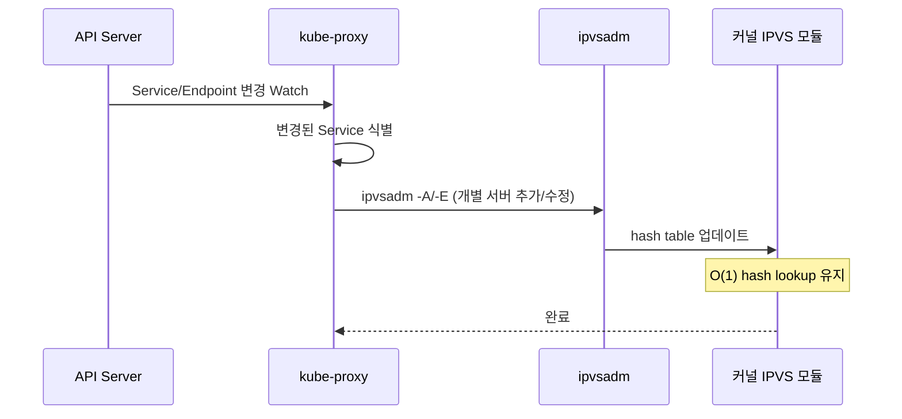
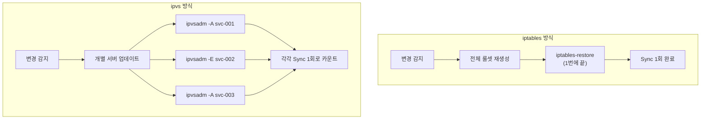

# ipvs 모드 심층 분석

## 동작 원리

kube-proxy ipvs 모드는 Linux 커널의 **IPVS(IP Virtual Server)** 모듈을 활용합니다. iptables처럼 전체 룰을 교체하는 대신, 개별 Virtual Server를 `ipvsadm` 명령으로 **추가/수정/삭제**합니다.



### ipvsadm의 동작

```bash
# Virtual Server 추가
ipvsadm -A -t 10.100.0.1:80 -s rr

# Real Server (Endpoint) 추가
ipvsadm -a -t 10.100.0.1:80 -r 10.0.1.10:80 -m

# Virtual Server 삭제
ipvsadm -D -t 10.100.0.1:80

# 현재 상태 확인
ipvsadm -Ln
```

## Hash 기반 O(1) 룩업

ipvs의 핵심 장점은 **hash table 기반의 O(1) 룩업**입니다.


| 구조 | iptables | ipvs |
|------|----------|------|
| 룩업 방식 | O(n) 순차 체인 탐색 | **O(1) hash table** |
| 100 Services | 100개 룰 순차 비교 | 1번 hash 조회 |
| 1,000 Services | 1,000개 룰 순차 비교 | 1번 hash 조회 |
| 패킷 처리 확장성 | 선형 저하 | **일정 유지** |

## Full Sync 메트릭이 없는 이유

:::danger ipvs에는 Full Sync 개념이 없습니다
ipvs 모드는 `kubeproxy_sync_full_proxy_rules_duration_seconds` 메트릭을 **노출하지 않습니다**.

이는 아키텍처의 근본적 차이에서 기인합니다:

| | iptables / nftables | ipvs |
|---|---|---|
| 동기화 방식 | 전체 룰셋 bulk 교체 | 개별 서버 추가/삭제 |
| "Full Sync" | 전체 교체 = Full Sync | 개별 추가의 연속일 뿐 |
| 메트릭 | `sync_full_proxy_rules_duration` 존재 | 해당 메트릭 **없음** |

ipvs에서 "초기 동기화"는 개별 Virtual Server를 하나씩 빠르게 추가하는 과정이며, 이를 단일 Full Sync로 측정하지 않습니다.
:::

## Sync Duration

### Regular Sync

| 측정값 | 수치 |
|--------|------|
| 평균 | **0.232s** |
| Sync 횟수 | **1,613회** |
| 비교 (iptables) | 0.737s / 201회 |

ipvs는 sync가 약 **8배 더 빈번**하지만, 개별 sync는 약 **3배 더 빠릅니다**.

### Sync 빈도가 높은 이유



## 스케줄러 옵션

ipvs는 다양한 로드 밸런싱 알고리즘을 지원합니다:

| 스케줄러 | 약어 | 설명 | 적합한 상황 |
|----------|------|------|------------|
| **Round Robin** | `rr` | 순차 분배 | 균일한 Pod 스펙 (이 테스트에서 사용) |
| Least Connection | `lc` | 최소 연결 우선 | 장시간 연결 |
| Weighted Least Connection | `wlc` | 가중 최소 연결 | 이기종 Pod 스펙 |
| Source Hashing | `sh` | 소스 IP 기반 | 세션 고정 필요 |
| Destination Hashing | `dh` | 목적지 IP 기반 | 캐시 클러스터 |

```yaml
# kube-proxy ipvs 스케줄러 설정
addons:
  - name: kube-proxy
    configurationValues: '{"mode": "ipvs", "ipvs": {"scheduler": "rr"}}'
```

## 강점

| 항목 | 설명 |
|------|------|
| **O(1) hash lookup** | Service 수 증가에도 패킷 처리 성능 일정 |
| **안정적 P99** | 고부하에서 400ms P99 (iptables 491ms 대비 양호) |
| **검증된 대안** | 대규모 클러스터에서 오랜 운영 실적 |
| **다양한 스케줄러** | rr, lc, wlc, sh, dh 등 선택 가능 |
| **빠른 개별 Sync** | 0.232s 평균 sync 시간 |

## 약점

| 항목 | 설명 |
|------|------|
| **~19% 낮은 QPS** | iptables/nftables 대비 일관되게 낮은 처리량 |
| **높은 Sync 빈도** | 1,613회로 iptables(201회)의 8배 |
| **iptables 의존** | SNAT/masquerade에 여전히 iptables 룰 필요 |
| **Full Sync 메트릭 부재** | 초기 동기화 시간 정확한 측정 어려움 |
