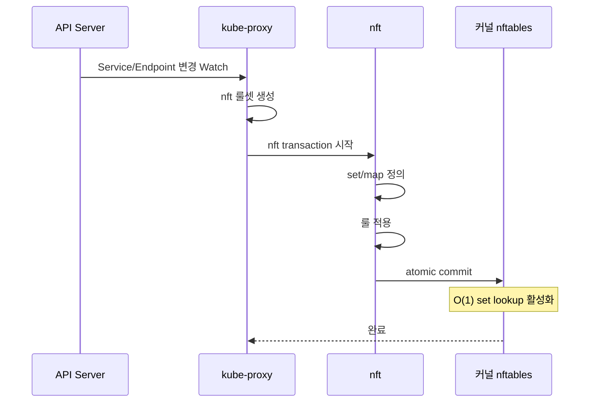
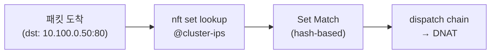
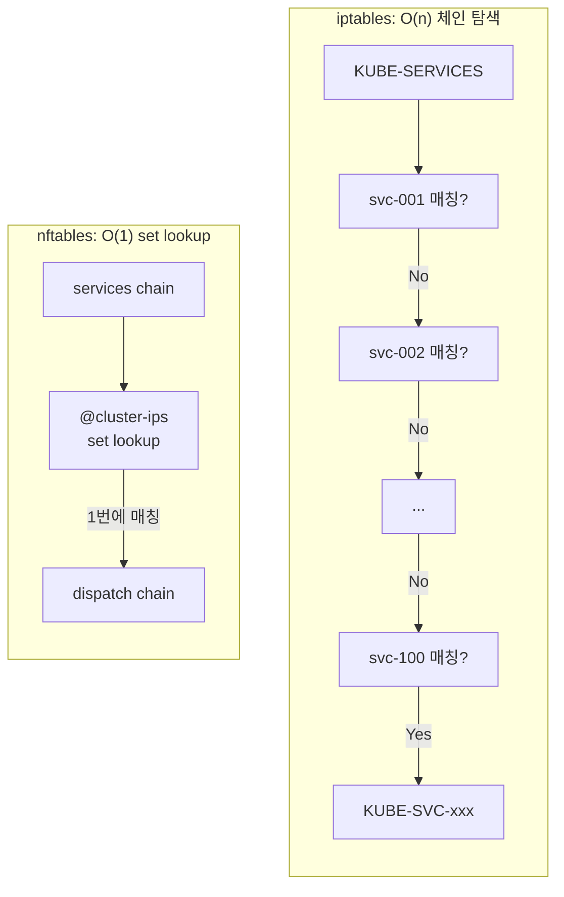

# nftables 모드 심층 분석

## 동작 원리

kube-proxy nftables 모드는 Linux 커널의 **nftables** 프레임워크를 활용합니다. `nft` 명령으로 **transaction 기반의 원자적(atomic) 룰셋 교체**를 수행하며, **nft set**을 활용하여 O(1) 룩업을 구현합니다.



### nft transaction의 동작

```bash
# nft transaction 기반 룰 적용
nft -f - << 'RULES'
table ip kube-proxy {
    set cluster-ips {
        type ipv4_addr . inet_proto . inet_service
        elements = {
            10.100.0.1 . tcp . 80,
            10.100.0.2 . tcp . 80,
            ...
        }
    }

    chain services {
        type nat hook prerouting priority dstnat;
        ip daddr . meta l4proto . th dport @cluster-ips jump dispatch
    }

    chain dispatch {
        # set lookup으로 O(1) Service 매칭
        ...
    }
}
RULES
```

## nft Set 기반 O(1) 룩업

nftables의 핵심 혁신은 **nft set**을 활용한 O(1) 룩업입니다.



| 구조 | iptables | nftables |
|------|----------|----------|
| 룩업 방식 | O(n) 순차 체인 탐색 | **O(1) nft set lookup** |
| 룰 구조 | Service별 체인 (수백 개) | set/map (단일 자료구조) |
| 100 Services | ~54K 개별 룰 | set에 100 엔트리 |
| 1,000 Services | ~537K 개별 룰 | set에 1,000 엔트리 |

## EKS 지원 현황

| 항목 | 상태 |
|------|------|
| KEP | [KEP-3866](https://github.com/kubernetes/enhancements/issues/3866) |
| Kubernetes 지원 | 1.31+ (Beta) |
| EKS 지원 | **1.31+** |
| 기본 모드 | 아니오 (명시적 설정 필요) |

```yaml
# EKS에서 nftables 모드 활성화
addons:
  - name: kube-proxy
    configurationValues: '{"mode": "nftables"}'
```

## Sync Duration 메트릭

### Full Sync

```promql
kubeproxy_sync_full_proxy_rules_duration_seconds
```

| 측정값 | 수치 |
|--------|------|
| 평균 | **1.56s** |
| 비교 (iptables) | 29.55s (19배 느림) |
| 발생 시점 | 노드 Join, kube-proxy 재시작 |

### Regular Sync

```promql
kubeproxy_sync_proxy_rules_duration_seconds
```

| 측정값 | 수치 |
|--------|------|
| 평균 | **0.260s** |
| Sync 횟수 | 203회 |
| 비교 (iptables) | 0.737s / 201회 |

## 성능 하이라이트

### 고부하 P99 레이턴시

| 동시 연결 | iptables P99 | nftables P99 | 개선 |
|-----------|-------------|-------------|------|
| 1,000 | 121ms | 202ms | iptables 우세 |
| 5,000 | **491ms** | **391ms** | **nftables 20% 개선** |

고부하 환경에서 nftables의 P99 tail latency가 가장 안정적입니다.

### 스케일아웃 시간

| 모드 | 총 서비스 가용 시간 |
|------|-------------------|
| iptables | 73.5s |
| ipvs | ~78s |
| **nftables** | **45.6s** |

신규 노드 추가 시 **가장 빠른 서비스 가용성**을 달성합니다.

## iptables vs nftables 구조 비교



## 강점

| 항목 | 설명 |
|------|------|
| **가장 빠른 Full Sync** | 1.56s (iptables 29.55s 대비 19배) |
| **최고 고부하 P99** | 5K conn에서 391ms (최저) |
| **가장 짧은 스케일아웃** | 45.6s 총 서비스 가용 시간 |
| **O(1) set lookup** | Service 수 증가에도 패킷 처리 성능 일정 |
| **현대적 커널 통합** | nftables는 iptables의 공식 후속 프레임워크 |
| **효율적 룰 구조** | set/map으로 룰 수 대폭 감소 |

## 약점

| 항목 | 설명 |
|------|------|
| **가장 새로운 모드** | EKS 1.31+ (2024년~), 프로덕션 트랙 레코드 부족 |
| **커뮤니티 경험 부족** | iptables/ipvs 대비 트러블슈팅 자료 적음 |
| **저부하 P99** | 1K conn에서 202ms (iptables 121ms 대비 높음) |
| **커널 버전 의존** | nftables 기능은 커널 버전에 따라 상이 |

:::tip nftables는 iptables의 공식 후속
nftables는 Linux 커널의 netfilter 프로젝트에서 iptables를 대체하기 위해 개발되었습니다. 장기적으로 iptables는 deprecated 될 예정이며, nftables가 Linux 기본 방화벽 프레임워크가 됩니다.
:::
