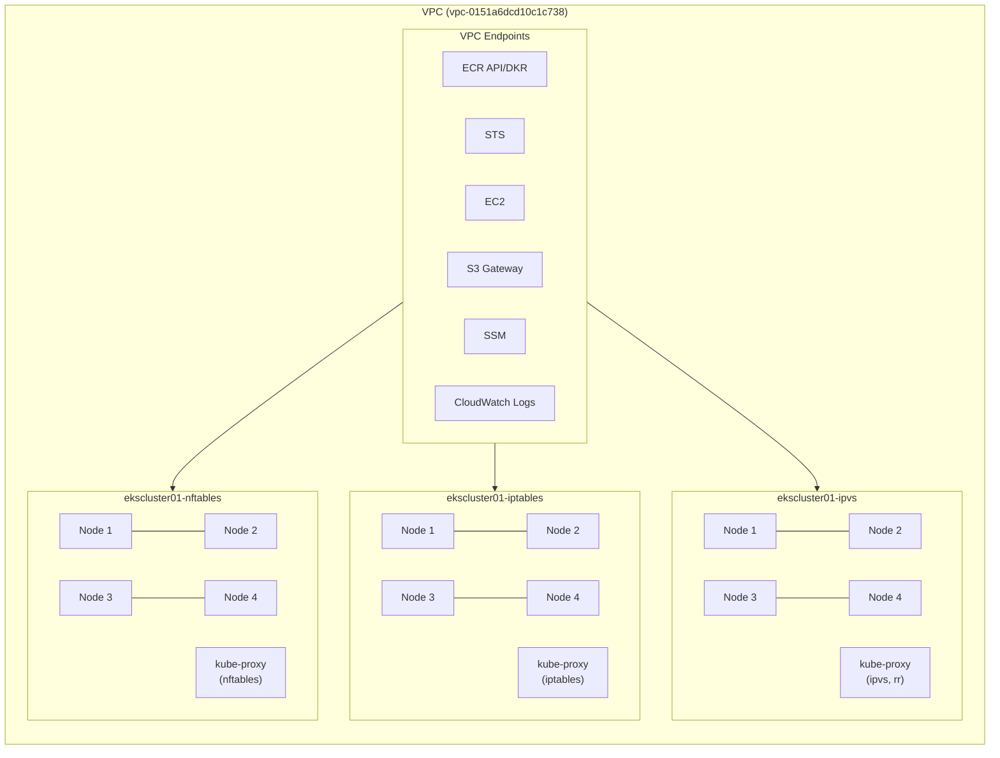
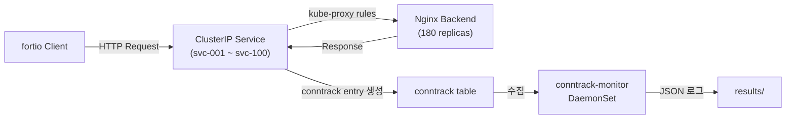

# 아키텍처

## 개요

동일한 VPC 내에서 3개의 EKS 클러스터를 운영하여, kube-proxy 모드별(iptables / ipvs / nftables) conntrack table sync 시간과 성능 차이를 비교 분석합니다.

## 클러스터 구성

| 클러스터 | kube-proxy 모드 | 노드 구성 | 비고 |
|---------|----------------|----------|------|
| `ekscluster01-iptables` | iptables (기본) | m6g.xlarge × 4 | 기본 모드, 변경 없음 |
| `ekscluster01-ipvs` | ipvs (scheduler: rr) | m6g.xlarge × 4 | round-robin 스케줄러 |
| `ekscluster01-nftables` | nftables | m6g.xlarge × 4 | EKS 1.31+ 지원 |

모든 클러스터는 다음 사양을 공유합니다:

- **EKS 버전**: 1.35.2
- **인스턴스 타입**: m6g.xlarge (Graviton ARM64)
- **노드 AMI**: AL2023 ARM64
- **노드 수**: 4대
- **VPC**: `vpc-0151a6dcd10c1c738` (Private Subnets Only)

## 아키텍처 다이어그램



## 데이터 흐름

각 클러스터 내부에서 부하 테스트 데이터가 흐르는 과정입니다.



### 단계별 설명

1. **fortio Client** — 동시 연결 수(1K/5K/10K/50K)로 HTTP 부하 생성
2. **ClusterIP Service** — kube-proxy가 관리하는 iptables/ipvs/nftables 룰로 트래픽 분배
3. **Nginx Backend** — 180개 Pod가 요청 처리
4. **conntrack table** — 커널에서 연결 추적 엔트리 생성/관리
5. **conntrack-monitor DaemonSet** — 5초 간격으로 conntrack 통계 수집
6. **results/** — JSON 형태로 메트릭 저장

## VPC Endpoints

Private Subnet 전용 클러스터이므로 다음 VPC Endpoint가 필수입니다:

| Endpoint | 타입 | 용도 |
|----------|------|------|
| ECR API / DKR | Interface | 컨테이너 이미지 Pull |
| STS | Interface | IAM 인증 |
| EC2 | Interface | ENI 관리 |
| S3 | Gateway | ECR 이미지 레이어, 로그 |
| SSM | Interface | Session Manager 접근 |
| CloudWatch Logs | Interface | 로그 전송 |

:::warning VPC Endpoint Security Group 주의사항
VPC Endpoint의 Security Group은 **3개 클러스터의 SG를 모두 포함**해야 합니다. 클러스터를 순차적으로 생성할 경우, 나중에 생성된 클러스터의 SG를 Endpoint SG에 추가하는 것을 잊지 마세요.

```bash
# 각 클러스터의 SG를 VPC Endpoint SG에 추가
aws ec2 modify-vpc-endpoint \
  --vpc-endpoint-id vpce-xxx \
  --add-security-group-ids sg-cluster01 sg-cluster02 sg-cluster03
```
:::
