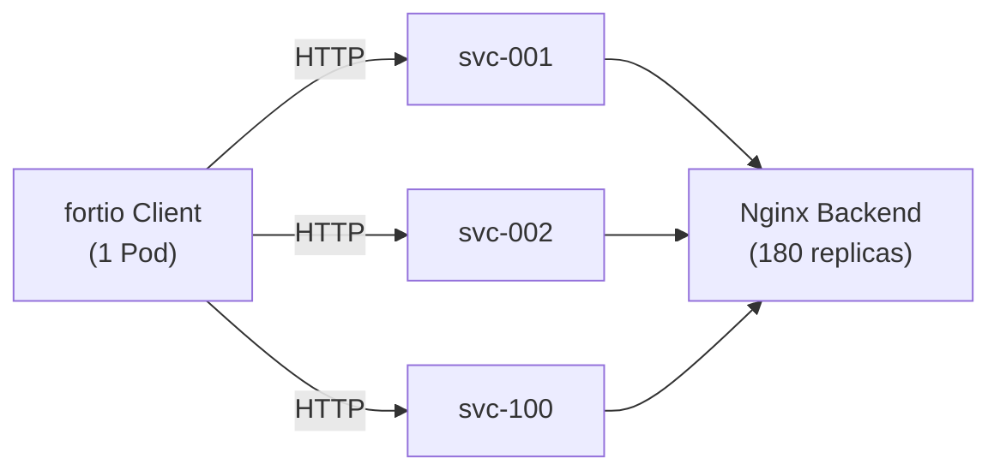

# 테스트 워크로드

## 구성 요소



## Nginx Backend

| 항목 | 값 |
|------|------|
| 이미지 | `nginx:latest` |
| Replicas | **180** |
| Port | 80 |
| Namespace | `conntrack-test` |

:::warning 58 Pods/Node ENI 제한
m6g.xlarge 인스턴스의 ENI 제한으로 노드당 최대 **58개 Pod**을 배치할 수 있습니다. 4개 노드 기준 이론상 최대 232개이지만, 시스템 Pod(kube-proxy, coredns, vpc-cni 등)을 고려하면 **180개**가 안정적인 상한입니다. 200개로 설정 시 일부 Pod가 Pending 상태에 빠집니다.

```
노드당 Pod 제한 = (ENI 수 × ENI당 IP 수) - 1
m6g.xlarge: (4 × 15) - 1 = 59 → 실효 58개
4 노드 × 58 = 232 (이론상 최대)
232 - 시스템 Pod (~20개) ≈ 212 (실효 최대)
→ 안정적 운영: 180 replicas
```
:::

## ClusterIP Services

| 항목 | 값 |
|------|------|
| Service 수 | **101개** (svc-001 ~ svc-100 + fortio-ui) |
| EndpointSlice 수 | **201개** |
| Service Type | ClusterIP |
| Port | 80 → 80 |
| Selector | `app: nginx-backend` |

### Service 생성 예시

```yaml
apiVersion: v1
kind: Service
metadata:
  name: svc-001
  namespace: conntrack-test
spec:
  type: ClusterIP
  selector:
    app: nginx-backend
  ports:
    - port: 80
      targetPort: 80
```

## fortio Client

| 항목 | 값 |
|------|------|
| 이미지 | `fortio/fortio:latest` |
| Replicas | 1 |
| 명령어 | `fortio server -http-port 8080` |
| Namespace | `conntrack-test` |

:::tip fortio server 모드
fortio Pod는 `sleep infinity`가 아닌 `fortio server -http-port 8080` 명령으로 실행합니다. fortio 이미지는 distroless 기반이라 shell이 없으며, server 모드로 실행하면 Web UI와 REST API를 통해 부하 테스트를 실행할 수 있습니다.
:::

### 부하 테스트 실행

```bash
# fortio Pod에서 부하 테스트 실행
kubectl exec -n conntrack-test deploy/fortio-client -- \
  fortio load \
    -c 1000 \
    -t 300s \
    -qps 0 \
    http://svc-001.conntrack-test.svc.cluster.local:80
```

| 파라미터 | 설명 |
|----------|------|
| `-c <conn>` | 동시 연결 수 (1000, 5000, 10000, 50000) |
| `-t <duration>` | 테스트 지속 시간 (300s = 5분) |
| `-qps 0` | QPS 제한 없음 (최대 성능 측정) |
| URL | Service FQDN 사용 |

### 테스트 시나리오

| 단계 | 동시 연결 | 지속 시간 | 목적 |
|------|----------|----------|------|
| 1 | 1,000 | 300s | 기본 성능 측정 |
| 2 | 5,000 | 300s | 중간 부하 |
| 3 | 10,000 | 300s | 고부하 |
| 4 | 50,000 | 300s | 극한 부하 |
