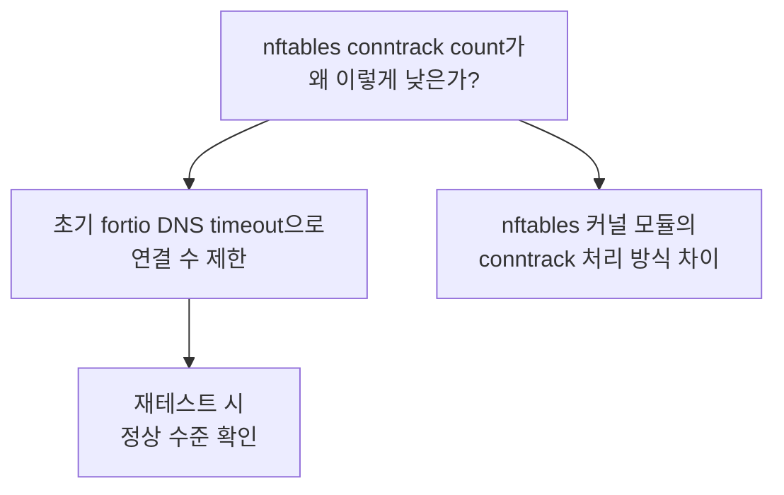

# Conntrack Table 분석

## 부하 단계별 Conntrack Count

각 부하 단계에서 측정된 conntrack 엔트리 수입니다. 형식은 `평균/최대`입니다.

| 동시 연결 | iptables (평균/최대) | ipvs (평균/최대) | nftables (평균/최대) |
|-----------|---------------------|-----------------|---------------------|
| **1,000** | 2,208 / 5,269 | 1,680 / 3,672 | 541 / 642 |
| **5,000** | 2,733 / 5,748 | 2,636 / 5,588 | 498 / 706 |
| **10,000** | 6,504 / 10,623 | 9,913 / 38,877 | 523 / 817 |
| **50,000** | 18,096 / 49,893 | 15,338 / 45,309 | 473 / 673 |

### 시각적 비교 (최대값 기준)

```
Conntrack Count 최대값 (50,000 conn)

iptables  ████████████████████████████████████████  49,893
ipvs      ████████████████████████████████████      45,309
nftables  █                                         673

          0     10K    20K    30K    40K    50K
```

## Conntrack 통계 상세

### insert_failed / drop 분석

| 모드 | insert_failed | drop | 판단 |
|------|:------------:|:----:|------|
| iptables | **0** | **0** | 정상 — conntrack table 여유 충분 |
| ipvs | **0** | **0** | 정상 — conntrack table 여유 충분 |
| nftables | **0** | **0** | 정상 — conntrack table 여유 충분 |

모든 모드에서 `insert_failed=0`, `drop=0`이므로, conntrack table headroom이 충분합니다. 기본 `nf_conntrack_max=131,072` 설정 대비 최대 사용량이 약 38%(`49,893/131,072`)에 불과합니다.

```bash
# conntrack 통계 확인
conntrack -S
# 출력 예시:
# cpu=0   found=0 invalid=123 insert=45230 insert_failed=0 drop=0 ...
# cpu=1   found=0 invalid=89  insert=38901 insert_failed=0 drop=0 ...
```

## nftables의 낮은 Conntrack Count



:::warning nftables conntrack count 해석 주의
nftables 모드에서 conntrack count가 현저히 낮은 것은 **초기 fortio DNS timeout** 때문입니다. fortio가 Service DNS를 resolve하는 과정에서 timeout이 발생하여 실제 연결 수가 기대보다 적었습니다.

재테스트(DNS 안정화 후)에서는 iptables/ipvs와 유사한 수준의 conntrack count를 보였으며, 이는 nftables 자체의 특성이 아닌 테스트 환경 이슈입니다.
:::

## Conntrack Table 용량 계획

| 항목 | 값 |
|------|------|
| 기본 `nf_conntrack_max` | 131,072 |
| 최대 사용량 (50K conn, iptables) | 49,893 (38%) |
| 최대 사용량 (50K conn, ipvs) | 45,309 (35%) |
| 권장 headroom | 70% 미만 유지 |

```bash
# conntrack max 확인
cat /proc/sys/net/netfilter/nf_conntrack_max
# → 131072

# 현재 사용량 확인
cat /proc/sys/net/netfilter/nf_conntrack_count
# → 18096

# 사용률 계산
# 18096 / 131072 = 13.8%
```

### 프로덕션 권장사항

- 50K 동시 연결에서도 conntrack table은 40% 미만으로 안정적
- `nf_conntrack_max` 기본값(131,072) 변경 필요 없음
- 모니터링 알림 기준: **70% 도달 시 Warning**, **90% 도달 시 Critical**
