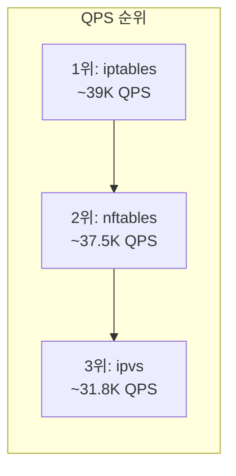

# 부하 테스트 결과

## 테스트 조건

- **테스트 도구**: fortio
- **대상 Service**: `svc-001.conntrack-test.svc.cluster.local:80`
- **QPS 제한**: 없음 (`-qps 0`)
- **테스트 시간**: 300초 (5분)
- **성공률**: 모든 테스트 **100% Code 200**

## 1,000 동시 연결 (300초)

| 모드 | QPS | P50 | P99 | Code 200 |
|------|-----|-----|-----|----------|
| **iptables** | **39,036** | 25ms | 121ms | 100% |
| **ipvs** | 31,702 | 32ms | 170ms | 100% |
| **nftables** | 37,558 | 27ms | 202ms | 100% |

```
QPS 비교 (1,000 conn)

iptables  ████████████████████████████████████████  39,036
nftables  ██████████████████████████████████████    37,558
ipvs      ████████████████████████████████          31,702

          0     10K    20K    30K    40K
```

## 5,000 동시 연결 (300초)

| 모드 | QPS | P50 | P99 | Code 200 |
|------|-----|-----|-----|----------|
| **iptables** | **39,419** | 153ms | 491ms | 100% |
| **ipvs** | 31,891 | 190ms | **400ms** | 100% |
| **nftables** | 37,375 | **150ms** | **391ms** | 100% |

```
P99 레이턴시 비교 (5,000 conn)

iptables  ████████████████████████████████████████  491ms
ipvs      █████████████████████████████████         400ms
nftables  ████████████████████████████████          391ms

          0    100   200   300   400   500
```

## 결과 분석

### QPS 성능



- **iptables가 QPS에서 1위**: 저부하/중부하 모두에서 가장 높은 처리량을 보여줍니다. 101개 Service 규모에서는 iptables의 O(n) 룰 체인 탐색이 아직 병목이 되지 않습니다.
- **ipvs는 일관되게 ~19% 낮은 QPS**: 1K 연결(31,702)과 5K 연결(31,891) 모두에서 iptables/nftables 대비 약 19% 낮은 QPS를 보입니다.
- **nftables는 iptables에 근접**: 약 4% 차이로 QPS 성능이 매우 유사합니다.

### P99 레이턴시

| 동시 연결 | iptables P99 | ipvs P99 | nftables P99 | 최적 모드 |
|-----------|-------------|----------|-------------|----------|
| 1,000 | 121ms | 170ms | 202ms | iptables |
| 5,000 | **491ms** | 400ms | **391ms** | **nftables** |

- **저부하(1K)**: iptables가 가장 낮은 P99 (121ms)
- **고부하(5K)**: nftables가 가장 낮은 P99 (391ms), iptables는 491ms로 급증

:::tip 101 Services는 소규모입니다
이 테스트는 101개 Service 규모에서 수행되었습니다. **500개 이상의 Service** 환경에서는 iptables의 패킷 처리 성능이 크게 저하됩니다.

iptables는 패킷마다 **O(n) 순차 룰 체인 탐색**을 수행합니다:
- 101 Services: ~54K 룰 → 아직 큰 영향 없음
- 500 Services: ~268K 룰 → 패킷당 탐색 시간 증가
- 1,000 Services: ~537K 룰 → 심각한 성능 저하

반면 ipvs는 O(1) hash lookup, nftables는 nft set 기반 O(1) lookup을 사용하므로 Service 수 증가에 따른 성능 저하가 거의 없습니다.
:::

### 종합 판단

| 관점 | 최적 모드 | 설명 |
|------|----------|------|
| 최대 처리량 (QPS) | iptables | 소규모 Service에서 가장 높은 QPS |
| 고부하 P99 안정성 | nftables | 5K 연결에서 가장 낮은 tail latency |
| 일관된 성능 | nftables | 부하 증가에 따른 P99 변동이 가장 적음 |
| QPS 효율성 | ipvs | QPS는 낮지만, P99 안정성은 양호 |
