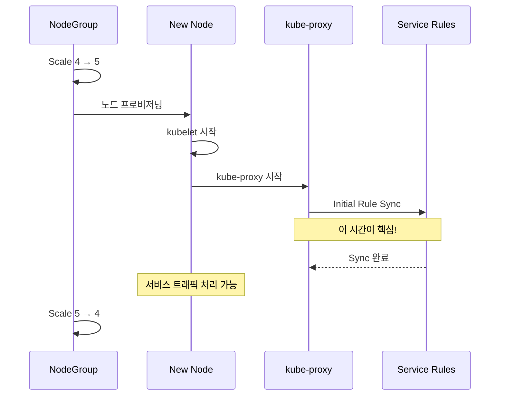

# 노드 스케일아웃 테스트

## 테스트 설계

Auto Scaling 환경에서 새 노드가 추가될 때, kube-proxy가 모든 Service 룰을 동기화하여 서비스 트래픽을 처리할 수 있을 때까지의 시간을 측정합니다.



### 테스트 절차

```bash
# 1. 노드그룹 4 → 5 스케일아웃
eksctl scale nodegroup --cluster ekscluster01-iptables \
  --name ng-iptables --nodes 5

# 2. 새 노드 Ready 대기
kubectl wait --for=condition=Ready node --all --timeout=300s

# 3. kube-proxy initial sync 시간 측정
kubectl logs -n kube-system -l k8s-app=kube-proxy --since=5m | \
  grep "sync_proxy_rules"

# 4. 노드그룹 5 → 4 복원
eksctl scale nodegroup --cluster ekscluster01-iptables \
  --name ng-iptables --nodes 4
```

## 결과

| 단계 | iptables | ipvs | nftables |
|------|----------|------|----------|
| 노드 Join (Ready) | 44s | 76s | 44s |
| kube-proxy Initial Sync | **29.5s** | **~1-2s** | **1.6s** |
| **총 서비스 가용 시간** | **73.5s** | **~78s** | **45.6s** |

### 시각적 비교

```
총 서비스 가용 시간 (초)

            Node Join        kube-proxy Sync
            ┌──────────┐    ┌─────────────────┐
iptables    │   44s    │    │     29.5s        │  = 73.5s
            └──────────┘    └─────────────────┘

            ┌──────────────────┐ ┌──┐
ipvs        │      76s         │ │2s│             = ~78s
            └──────────────────┘ └──┘

            ┌──────────┐ ┌──┐
nftables    │   44s    │ │2s│                    = 45.6s
            └──────────┘ └──┘

            0    20   40   60   80
```

## 분석

### nftables가 가장 빠른 이유

| 요소 | iptables | ipvs | nftables |
|------|----------|------|----------|
| 노드 Join | 44s | 76s | 44s |
| Rule Sync | 29.5s | ~1-2s | 1.6s |
| 합계 | 73.5s | ~78s | **45.6s** |
| 병목 | Rule Sync | Node Join | 없음 |

- **iptables**: 노드 Join은 빠르지만, 54,214개 NAT 룰의 Full Sync에 29.5초가 소요되어 전체 시간이 길어집니다.
- **ipvs**: Rule Sync는 빠르지만, 이 테스트에서 노드 Join에 76초가 소요되었습니다 (네트워크 또는 AMI 캐시 상태에 따라 변동).
- **nftables**: 노드 Join(44s)과 Rule Sync(1.6s) 모두 빨라서 **총 서비스 가용 시간이 가장 짧습니다**.

:::tip 오토스케일링 환경에서의 핵심 메트릭
이 **총 서비스 가용 시간**이야말로 오토스케일링 환경에서 가장 중요한 메트릭입니다.

트래픽 급증 시 새 노드가 추가되더라도, kube-proxy rule sync가 완료되기 전까지는 해당 노드의 Pod로 트래픽이 정상적으로 라우팅되지 않습니다.

- **iptables**: 73.5초 → 약 1분 이상 서비스 불가
- **nftables**: 45.6초 → 약 45초만에 서비스 가능

프로덕션 환경에서 Service 수가 500개 이상이면 iptables의 Full Sync는 **150초 이상**으로 예상되며, 이는 오토스케일링의 효과를 크게 저해합니다.
:::

## 프로덕션 시나리오 추정

| Service 수 | iptables Sync (추정) | nftables Sync (추정) | 차이 |
|-----------|---------------------|---------------------|------|
| 101 | 29.5s | 1.6s | 18배 |
| 500 | ~150s | ~8s | 19배 |
| 1,000 | ~300s | ~16s | 19배 |
| 2,000 | ~600s | ~32s | 19배 |

:::warning 대규모 클러스터에서의 영향
Service 1,000개 이상의 대규모 클러스터에서 iptables 모드를 사용하면, 새 노드 추가 시 **5분 이상** kube-proxy rule sync를 기다려야 합니다. 이 기간 동안 해당 노드의 Pod는 Service 트래픽을 정상적으로 처리할 수 없습니다.
:::
