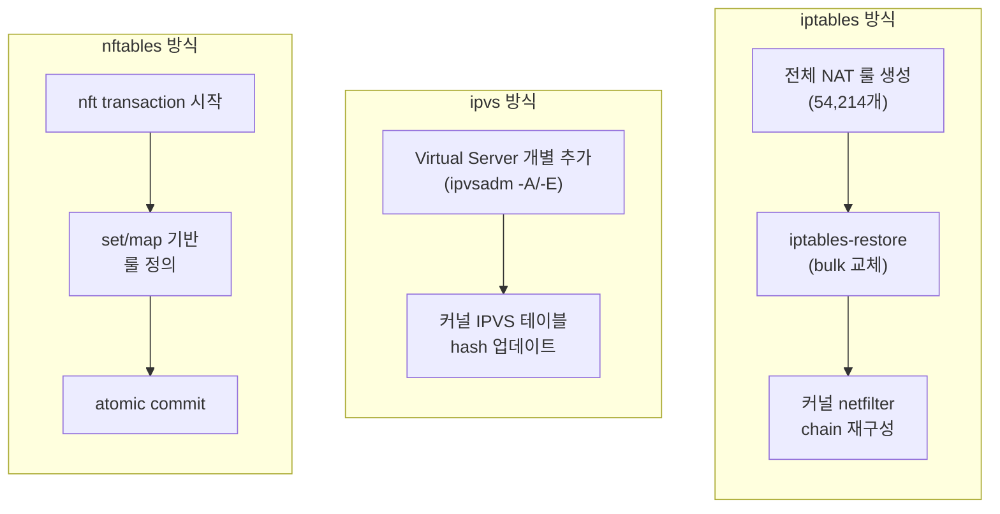

# Sync Duration 비교

:::danger 핵심 결론
iptables 모드의 Full Sync에 **29.55초**가 소요됩니다. 이는 nftables(1.56초) 대비 **약 19배** 느린 수치로, 노드 추가나 Service 변경 시 서비스 가용성에 직접적인 영향을 미칩니다.
:::

## Full Sync Duration

새로운 노드가 Join하거나 kube-proxy가 최초 기동할 때 발생하는 전체 룰 동기화 시간입니다.

| 모드 | Full Sync 시간 | 비고 |
|------|---------------|------|
| **iptables** | **29.55s** | `iptables-restore` 전체 NAT 테이블 교체 |
| **ipvs** | **N/A** (~1-2s 추정) | Full Sync 메트릭 없음 |
| **nftables** | **1.56s** | `nft` transaction 기반 원자적 교체 |

### 시각적 비교

```
Full Sync Duration (초)

iptables  ████████████████████████████████████████  29.55s
ipvs      ███                                       ~1-2s (추정)
nftables  ██                                        1.56s

          0    5    10   15   20   25   30
```

### 왜 이런 차이가 발생하는가?



- **iptables**: `iptables-restore` 명령으로 전체 NAT 테이블을 한번에 교체합니다. 101개 Service × ~537개 룰 = **54,214개 NAT 룰**을 한번에 기록하므로 시간이 오래 걸립니다.
- **ipvs**: `ipvsadm`으로 개별 Virtual Server를 추가/수정합니다. 전체를 한번에 교체하는 개념이 없어 Full Sync 메트릭 자체가 존재하지 않습니다.
- **nftables**: `nft` transaction으로 원자적 룰셋 교체를 수행합니다. nft set을 활용한 O(1) 룩업 구조로, 룰 수가 적어 빠릅니다.

:::danger ipvs에 Full Sync 메트릭이 없는 이유
ipvs 모드는 `kubeproxy_sync_full_proxy_rules_duration_seconds` 메트릭을 **노출하지 않습니다**. 이는 ipvs의 아키텍처적 차이 때문입니다:

- iptables/nftables: 전체 룰을 bulk로 교체 → "Full Sync"라는 개념이 존재
- ipvs: 개별 Virtual Server를 `ipvsadm -A`/`ipvsadm -D`로 추가/삭제 → 전체를 한번에 덮어쓰는 작업이 없음

따라서 ipvs의 Full Sync 시간은 Prometheus 메트릭이 아닌, 노드 Join 후 모든 Service가 활성화되기까지의 시간으로 추정합니다.
:::

## Regular Sync Duration

일상적인 Service/Endpoint 변경 시 발생하는 정기 동기화입니다.

| 모드 | 평균 Sync 시간 | Sync 횟수 | 비고 |
|------|---------------|----------|------|
| **iptables** | 0.737s | 201회 | 변경 시마다 전체 룰 교체 |
| **ipvs** | 0.232s | 1,613회 | 개별 서버 업데이트, 빈번한 sync |
| **nftables** | 0.260s | 203회 | transaction 기반 부분 업데이트 |

### 주요 관찰

- **ipvs는 sync 횟수가 ~8배 많음**: 개별 Virtual Server 단위로 업데이트하므로 sync 이벤트가 자주 발생하지만, 각 sync는 매우 빠릅니다.
- **iptables는 sync 시간이 ~3배 느림**: 매 sync마다 전체 NAT 룰을 교체하므로, Service 수에 비례하여 시간이 증가합니다.
- **nftables는 균형 잡힌 성능**: iptables와 비슷한 sync 횟수이면서, ipvs에 근접한 sync 시간을 보여줍니다.

## 신규 노드 Histogram 분포

노드가 새로 추가될 때 kube-proxy의 sync duration histogram 분포입니다.

### iptables

| Bucket (초) | 횟수 | 비고 |
|-------------|------|------|
| 0.001 ~ 1 | 14 | |
| 1 ~ 2 | 7 | |
| 2 ~ 4 | 4 | |
| 4 ~ 8 | 3 | |
| 8 ~ 16 | 0 | |
| **16 ~ 32** | **4** | **Full Sync 구간** |
| 합계 | **32** | |

### ipvs

| Bucket (초) | 횟수 | 비고 |
|-------------|------|------|
| 0.001 ~ 0.064 | 12 | |
| 0.064 ~ 0.128 | 45 | |
| 0.128 ~ 0.256 | 123 | |
| **0.256 ~ 0.512** | **218** | **최빈 구간** |
| 0.512 ~ 1 | 54 | |
| 1 ~ 2 | 12 | |
| 합계 | **464** | |

### nftables

| Bucket (초) | 횟수 | 비고 |
|-------------|------|------|
| 0.001 ~ 0.25 | 8 | |
| 0.25 ~ 0.5 | 12 | |
| **0.5 ~ 1** | **26** | **최빈 구간** |
| 1 ~ 2 | 10 | |
| 2 ~ 4 | 2 | Full Sync 구간 |
| 합계 | **58** | |

### 분포 비교 요약

```
Sync 횟수 분포

iptables  : ████████ 32 syncs (4개 > 16s)
ipvs      : ████████████████████████████████████████ 464 syncs (대부분 0.256~0.512s)
nftables  : ████████████ 58 syncs (대부분 0.5~1s)
```

## iptables NAT 룰 통계

```bash
# iptables NAT 룰 수 확인
iptables -t nat -L -n | wc -l
# → 54,214 (IPv4)

# Service당 룰 수
# 54,214 / 101 Services ≈ 537 룰/Service
```

| 항목 | 값 |
|------|------|
| 총 NAT 룰 수 (IPv4) | **54,214** |
| Service 수 | 101 |
| Service당 평균 룰 수 | **~537개** |
