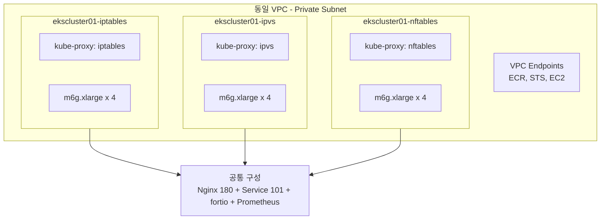

# EKS kube-proxy 모드 비교 분석

EKS 1.35 환경에서 kube-proxy 모드별(iptables / ipvs / nftables) **conntrack table sync 시간**, **패킷 처리 성능**, **노드 스케일아웃 영향도**를 비교 분석한 프로젝트입니다.

## 배경

EKS에서 오토스케일링으로 노드가 추가될 때, kube-proxy가 기존 모든 Service/EndpointSlice 룰을 초기화(Full Sync)하는 과정에서 **수십~수백 초의 지연**이 발생할 수 있습니다.

운영 환경에서 낮 시간대 트래픽 증가로 노드가 스케일아웃될 때, kube-proxy 초기 sync에 **50초에서 100초**가 소요되는 현상이 확인되었습니다.

이 프로젝트는 3가지 kube-proxy 모드를 **동일한 조건**에서 비교하여 최적의 모드를 선정하기 위한 **정량적 근거**를 제공합니다.

## 핵심 발견

### 초기 Full Sync 소요 시간 (101 Service 기준)

```
iptables  ████████████████████████████████████████  29.55s
ipvs      ██                                        ~1-2s (추정)
nftables  ██                                        1.56s

→ iptables는 ipvs/nftables 대비 15~19배 느림
```

:::danger iptables 선형 증가 문제
101개 Service에서 29.55s이므로:
- Service **500개** → ~150s
- Service **1,000개** → ~300s

iptables 모드는 Service 수에 **선형 비례**하여 초기 sync 시간이 증가합니다.
:::

### 모드별 특성 요약

| 특성 | iptables | ipvs | nftables |
|------|---------|------|---------|
| 초기 Full Sync | 29.55s | ~1-2s | 1.56s |
| Regular Sync 평균 | 0.737s | 0.232s | 0.260s |
| iptables NAT 룰 수 | **54,214** | N/A (해시) | N/A (nft set) |
| QPS (1K conn) | **39,036** | 31,702 | 37,558 |
| P99 (5K conn) | 491ms | 400ms | **391ms** |
| 스케일아웃 총 시간 | ~73.5s | ~78s | **~45.6s** |
| 성숙도 | 가장 검증됨 | 안정적 | 최신 (EKS 1.31+) |

## 아키텍처



## 테스트 환경

| 항목 | 값 |
|-----|---|
| EKS 버전 | 1.35.2 |
| kube-proxy | v1.35.2-eksbuild.4 |
| 노드 | m6g.xlarge × 4 (Graviton ARM64, 4vCPU/16GiB) |
| AMI | Amazon Linux 2023 (kernel 6.12) |
| 네트워크 | Private subnet only, NAT Gateway |
| Services | 101개 (ClusterIP) |
| EndpointSlices | 201개 |
| Backend Pods | 180개 (Nginx) |
| 부하 도구 | fortio v1.75.1 |
| 모니터링 | kube-prometheus-stack (Helm) |
| 리전 | ap-northeast-2 |

## 다음 단계

- [아키텍처](./environment/architecture) — 테스트 환경 상세 구성
- [Sync Duration 비교](./results/sync-duration) — kube-proxy sync 시간 분석
- [부하 테스트 결과](./results/load-test) — fortio QPS/레이턴시 비교
- [결론 및 권장사항](./conclusion) — 모드 선택 가이드
